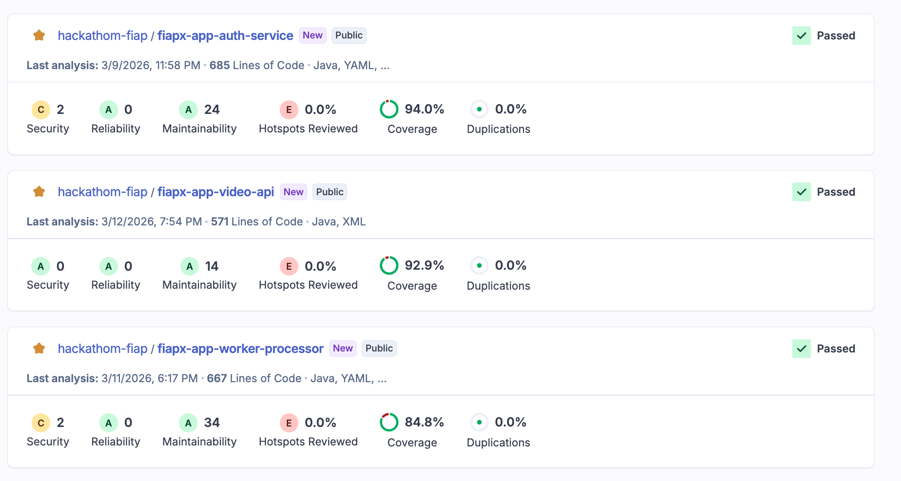
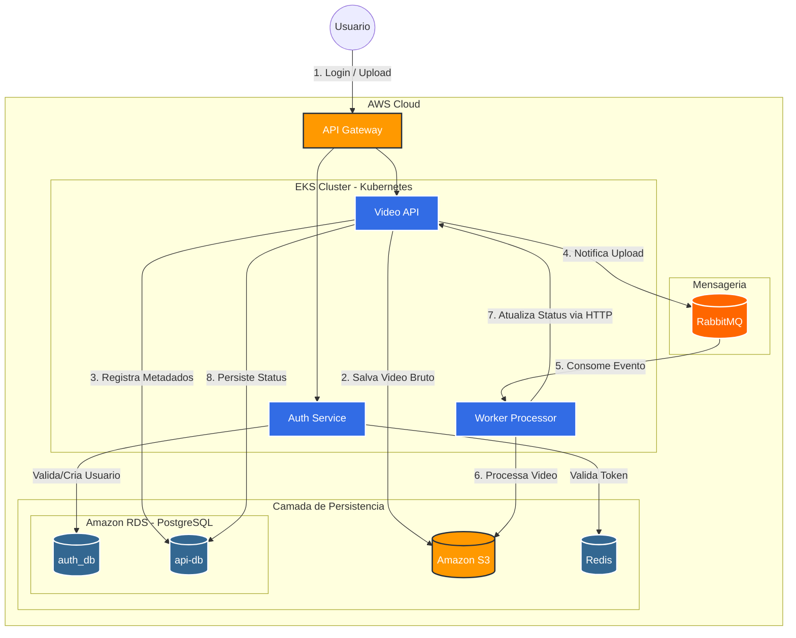

# Solucao FIAP X - Infraestrutura EKS e Arquitetura do Sistema

## Integrantes - Grupo 250 do Hackathon FIAP
*   Thiago Frozzi Ramos - RM363916
*   Denise da Silva Ferreira - RM360753
*   Humberto Moura Feitoza - RM360753

---
## Video da apresentação do Hackathon

*   [Apresentação do Hackathon](https://youtu.be/mbDetKJVOo4)

## Arquitetura do Sistema

O sistema foi concebido como uma plataforma de Processamento Distribuido de Videos, utilizando uma arquitetura orientada a eventos (Event-Driven) para garantir escalabilidade e resiliencia. A solucao roda em um cluster Amazon EKS (Kubernetes) e utiliza servicos gerenciados da AWS para persistencia e mensageria.

### Componentes Principais

#### 1. Entrada e Seguranca (Edge & Auth)
*   **API Gateway:** Ponto unico de entrada para todas as requisicoes externas.
*   **Auth Service (fiapx-app-auth):** Microsservico dedicado a autenticacao e autorizacao. Utiliza JWT para trafego seguro e Redis para gestao de sessoes e performance.

#### 2. Orquestracao e Upload (Core)
*   **Video API (fiapx-app-api):** Gerencia o ciclo de vida inicial do video. Recebe o upload, armazena o binario bruto no Amazon S3, registra metadados no PostgreSQL e dispara eventos de processamento.

#### 3. Processamento Assincrono (Worker)
*   **Worker Processor (fiapx-app-worker):** O componente de "heavy lifting". Consome mensagens do RabbitMQ, baixa o video do S3, realiza o processamento (extracao de imagens/frames) e gera um arquivo compactado (ZIP) de retorno.

#### 4. Camada de Dados e Mensageria
*   **Amazon RDS (PostgreSQL):** Banco de dados relacional para metadados de videos e usuarios.
*   **Amazon MQ (RabbitMQ):** Broker de mensagens para desacoplamento entre a API e o Worker.
*   **Amazon S3:** Storage de objetos para videos originais e arquivos processados.
*   **ElastiCache (Redis):** Cache de alta performance para o servico de autenticacao.

---

### Principais Endpoints da API

| Microsservico | Metodo | Rota | Descricao |
| :--- | :--- | :--- | :--- |
| **Auth** | `POST` | `/api/auth/register` | Realiza o cadastro de um novo usuario. |
| **Auth** | `POST` | `/api/auth/login` | Autentica o usuario e retorna o token JWT. |
| **Video API** | `POST` | `/api/videos/upload` | Recebe um ou mais videos para processamento. |
| **Video API** | `GET` | `/api/videos/status` | Lista o status de todos os videos do usuario logado. |
| **Video API** | `POST` | `/api/videos/{id}/status` | Endpoint interno para atualizacao de status (usado pelo Worker). |

## SonarQube

*   [SonarQube](https://sonarcloud.io/projects?sort=name)
*   Cobertura de Testes:

## Repositorios do Hackathon

### Infraestrutura
*   [Infra EKS (Kubernetes)](https://github.com/hackathom-fiap/fiapx-infra-eks)
*   [Infra Fila (AmazonMQ)](https://github.com/hackathom-fiap/fiapx-infra-amazonmq)
*   [Infra Database (PostgreSQL)](https://github.com/hackathom-fiap/fiapx-infra-postgres)
*   [Infra Redis](https://github.com/hackathom-fiap/fiapx-infra-redis)
*   [Infra IAM Roles](https://github.com/hackathom-fiap/fiapx-infra-roles)

### Microserviços (APIs)
*   [App Auth](https://github.com/hackathom-fiap/fiapx-app-auth)
*   [App Api](https://github.com/hackathom-fiap/fiapx-app-api)
*   [App Worker](https://github.com/hackathom-fiap/fiapx-app-worker)

---

### Diagrama de Arquitetura

---

## Stack Tecnologica

*   **Linguagem:** Java 17
*   **Framework:** Spring Boot 3.2.2
*   **Seguranca:** Spring Security + JWT
*   **Infraestrutura:** Terraform (IaC), AWS EKS, Docker
*   **Mensageria:** RabbitMQ (Protocolo AMQP)
*   **Qualidade:** JaCoCo e SonarCloud

---

## Diferenciais da Solucao (Hackathon)

1.  **Escalabilidade Horizontal:** O Worker Processor pode ser escalado independentemente da API (usando K8s HPA) conforme a fila do RabbitMQ cresce.
2.  **Arquitetura Hexagonal:** O uso de Ports and Adapters na Video API permite trocar o banco de dados ou o provider de nuvem com minimo impacto.
3.  **Seguranca Stateless:** Toda a comunicacao e protegida por JWT, eliminando a necessidade de manter estado de sessao no servidor da API.
4.  **Resiliencia:** Se o Worker falhar, a mensagem volta para a fila, garantindo que nenhum video deixe de ser processado.

---
